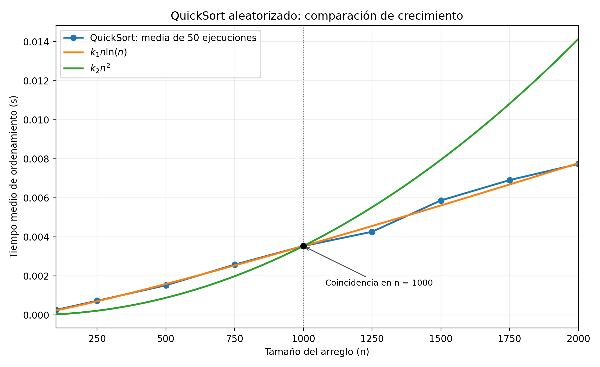

# QuickSort: análisis empírico mediante Monte Carlo

## Objetivo y algoritmo

Observar experimentalmente el crecimiento del tiempo de QuickSort con pivote aleatorio y compararlo con $n\ln(n)$ y $n^2$. La implementación conserva la clase `Solution` trabajada en la clase 4: `sortArray` llama a `quickSort` con límites `low` y `high`, y `partition` hace una partición de Lomuto sobre el mismo arreglo. La adaptación elige un índice aleatorio del segmento, intercambia su elemento con `A[high]` y continúa la partición original. No se utilizan funciones de ordenamiento incorporadas.

## Método

- Tamaños: `100, 250, 500, 750, 1000, 1250, 1500, 1750, 2000`.
- Repeticiones: 50 por tamaño; 450 ordenamientos en total.
- En cada ronda se recorren los nueve tamaños para distribuir entre ellos los cambios de carga del equipo.
- Cada repetición crea `list(range(n))` y la permuta con `random.shuffle` antes de medir.
- `time.perf_counter()` mide únicamente la llamada a `sortArray`. La comprobación de que el resultado es `list(range(n))` ocurre después de detener el reloj. Si falla, el experimento se interrumpe sin producir estadísticas.
- La media de cada tamaño es la suma de sus 50 tiempos dividida entre 50. Los resultados individuales están en [tiempos_quicksort.csv](data/tiempos_quicksort.csv) y las medias en [medias_quicksort.csv](data/medias_quicksort.csv).

La semilla seudoaleatoria `20261005` permite repetir la secuencia de permutaciones y pivotes. Los tiempos pueden cambiar entre máquinas o ejecuciones por la carga del sistema y el entorno de Python.

Se usa logaritmo natural, `math.log(n)`. Las constantes se calculan a partir de la media observada para $n=1000$:

$$
k_1=\frac{T(1000)}{1000\ln(1000)},\qquad
k_2=\frac{T(1000)}{1000^2}.
$$

Así, la medición y las curvas $k_1n\ln(n)$ y $k_2n^2$ coinciden en $n=1000$. Se trata de una calibración en un punto, no de un ajuste por regresión.

## Ejecución

Requiere Python 3.10 o posterior. Desde esta carpeta:

```bash
python3 -m venv .venv
.venv/bin/python -m pip install -r requirements.txt
.venv/bin/python quicksort_monte_carlo.py
```

El script sobrescribe los dos CSV y `images/quicksort_monte_carlo_comparacion.png` con una nueva ejecución de las 450 pruebas, y muestra las medias y constantes en pantalla. Las cifras documentadas abajo corresponden a la ejecución archivada en este repositorio.

## Resultados

La ejecución documentada se realizó con Python 3.10.12 en Linux/WSL2. Todos los 450 ordenamientos fueron validados.

| Tamaño $n$ | Tiempo medio (s) |
| ---: | ---: |
| 100 | 0.000261880 |
| 250 | 0.000731368 |
| 500 | 0.001524182 |
| 750 | 0.002583014 |
| 1000 | 0.003534478 |
| 1250 | 0.004267116 |
| 1500 | 0.005869372 |
| 1750 | 0.006911382 |
| 2000 | 0.007737556 |

Con $T(1000)=0.0035344778200033034$ s, las constantes calculadas son $k_1=5.116680712122899\times10^{-7}$ y $k_2=3.5344778200033035\times10^{-9}$. Las tres curvas toman el valor $0.0035344778200033034$ s en $n=1000$.

## Conclusión

En $n=2000$, la media medida es $0.007737556$ s, frente a $0.007778278$ s para $k_1n\ln(n)$ y $0.014137911$ s para $k_2n^2$. En este rango, los datos ofrecen evidencia empírica compatible con el crecimiento esperado $n\ln(n)$; no constituyen una demostración matemática. La curva cuadrática crece más rápidamente a medida que aumenta $n$. Los tiempos reales también incluyen variación debida al sistema operativo, el procesador, el intérprete, la resolución del reloj y el azar. Repetir 50 veces y promediar reduce el peso de una ejecución atípica, aunque no elimina esas fuentes de variación.


